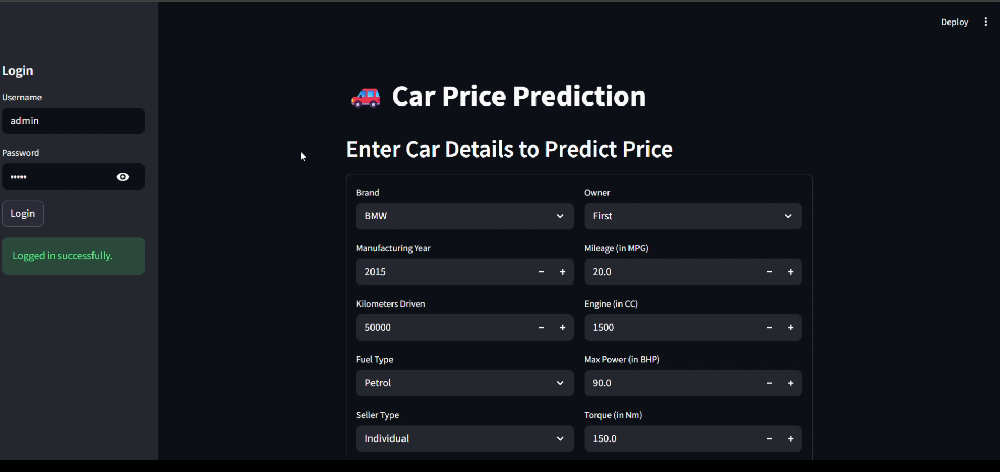

# 🚗 Car Price Prediction API

This project is a **Machine Learning-powered API** built using **FastAPI** to predict the selling price of a used car based on its characteristics.

---

## 📦 Project Features

- 🔐 **Authentication**: JWT-based token auth and API key validation
- 🧠 **ML Model Prediction**: Trained model predicts used car prices
- ⚡ **Redis Caching**: Avoid redundant model computation
- 📈 **Monitoring Ready**: Prometheus metrics + Grafana dashboards
- 🐳 **Dockerized Setup**: Simplified deployment with Docker Compose
- 🎨 **Streamlit Frontend**: Interactive web interface for predictions
- ☁️ **Cloud Deployment**: Easily deploy to [Render](https://render.com)

---

## 🎯 Application Preview



*Replace with your actual screenshot from the assets folder*

---

## 🎥 Demo Video

Watch the complete walkthrough of the Car Price Prediction application:

https://user-images.githubusercontent.com/YOUR-USERNAME/YOUR-VIDEO-ID.mp4

*Or use this format for videos in assets folder:*


**Note**: Upload your demo video to the `assets` folder or use GitHub's video upload feature in issues/PRs to get the direct link.

---

## 🧠 Model Input Variables

The prediction model expects the following input features:

| Feature           | Description                          | Example         |
|------------------|--------------------------------------|-----------------|
| `company`         | Brand of the car                     | `"Maruti"`      |
| `year`            | Year of manufacturing                | `2015`          |
| `owner`           | Number of previous owners            | `"Second"`      |
| `fuel`            | Fuel type                            | `"Petrol"`      |
| `seller_type`     | Individual or Dealer                 | `"Individual"`  |
| `transmission`    | Transmission type                    | `"Automatic"`   |
| `km_driven`       | Kilometers driven                    | `200000`        |
| `mileage_mpg`     | Mileage in miles per gallon          | `55`            |
| `engine_cc`       | Engine capacity in cc                | `1250`          |
| `max_power_bhp`   | Maximum power in BHP                 | `80`            |
| `torque_nm`       | Torque in Newton meters              | `200`           |
| `seats`           | Number of seats                      | `5`             |

---

## 🚀 Getting Started (Local)

### 1. Clone the Repository

```bash
git clone https://github.com/your-username/fastapi-project.git
cd fastapi-project
```

### 2. Set Environment Variables

```bash
API_KEY=demo-key
JWT_SECRET_KEY=your-secret
REDIS_URL=redis://localhost:6379
```

### 3. Build and Run via Docker

```bash
docker-compose up --build
```

### 4. Access Interfaces

- FastAPI Docs: http://localhost:8000/docs
- FastAPI Metrics: http://localhost:8000/metrics
- Prometheus UI: http://localhost:9090
- Grafana UI: http://localhost:3000

---

## 🎨 Running the Streamlit Frontend

### 1. Install Streamlit

```bash
pip install streamlit
```

Or install all dependencies including Streamlit:

```bash
pip install -r requirements.txt
```

### 2. Run the Frontend Application

```bash
streamlit run frontend.py
```

### 3. Access the Web Interface

The Streamlit app will automatically open in your browser at:
- Local URL: http://localhost:8501

You can now interact with the car price prediction model through an intuitive web interface!

---

## 🚀 Deployment on Render (API only)

1. Push code to GitHub
2. Add render.yaml to the project root
3. Create a new Web Service on Render
4. Include environment variables

---

## 📝 License

This project is licensed under the MIT License.

## 🤝 Contributing

Contributions, issues, and feature requests are welcome! Feel free to check the issues page.

---

<div align="center">

**Made with ❤️ by Om Manoj Sharma**

</div>